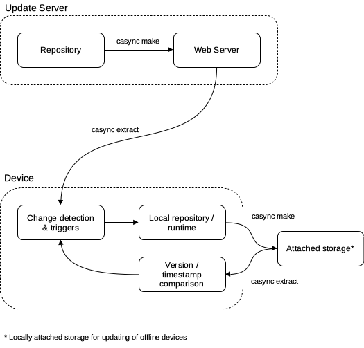

# casync-updater
casync based OTA updater for software running on linux

## Introduction
A simple self updating software update system with offline updating capabilities through locally attached storage (e.g. a USB drive).

