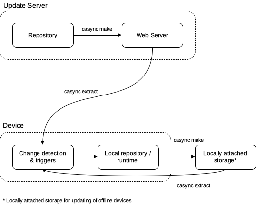

# casync-updater
casync based OTA updater for software running on linux

## Introduction
A simple self updating software update system with offline updating capabilities through locally attached storage (e.g. a USB drive). More information on casync can be found on by running ```man casync```.



## Server
The server.js Node.js script should executed passing the configuration file as an argument:
```console
node /usr/bin/casync-updater/server.js /home/updater/updater.json
```
This can be included as part of your CI/CD pipeline.

Configuration file example:
```json
{
    "index": "/var/www/html/index.caidx",
    "store": "/var/www/html/store.castr",
    "source": "/home/updater/source"
}
```
where:
* "index" is the path to the casync index file (typically stored in a web root directory).
* "store" is the path to the casync store directory (typically stored in a web root directory).
* "source" is the path to the directory or device where the repository to be distributed is stored.

casync will create a ```data.castr``` storage directory in the same directory where the index (.caidx / .caibx) file is stored.

## Client


Configuration file example:
```json
[
    {
        "interval": 60000,
        "index": "https://github.com/bccsa/casync-updater/updates/index.caidx",
        "store": "https://github.com/bccsa/casync-updater/updates/store.castr",
        "destination": "/usr/bin/casync-updater"
    },
    {
        "interval": 120000,
        "index": "https://myproject.example/updates/fancyName.caidx",
        "store": "https://myproject.example/updates/fancyName.castr",
        "backupIndex": "/media/backupDrive/myproject-updater/otherFancyName.caidx",
        "backupStore": "/media/backupDrive/myproject-updater/otherFancyName.castr",
        "destination": "/usr/bin/myproject"
    }
]
```
where:
* "interval" is the update interval in milliseconds
* "index" is the location of the (online) source casync (caidx) index file
* "destination" is the local directory path to be updated
* "backupIndex" (optional) is the path to the local backup casync index file (typically a location on external storage used for transferring updates to offline devices).
